# DAMP: O Algoritmo que vai revolucionar sua tática no xadrez

*Cláudio Nunes Duarte | Júlio Lapertosa*

---

## Prefácio

O livro que você tem em mãos é inteiramente dedicado à tática enxadrística. Embora em outras áreas – o futebol é um bom exemplo disso – as expressões "tática" e "estratégia" sejam muitas vezes intercambiáveis, no xadrez essas duas palavras denotam coisas inteiramente distintas. E é importante que você entenda a diferença.

Como sabemos, o objetivo final de uma partida de xadrez é dar xeque-mate ao Rei.

Entretanto, para alcançarmos esse objetivo, são necessários planos de médio e longo prazo, executados com a finalidade de melhorar gradativamente nossa posição. Através desses planos nossas peças tornam-se mais ativas, passamos a controlar mais espaço, a dominar o centro, nossa estrutura de peões apresenta-se mais saudável e o nosso Rei, mais seguro que o do oponente.

A partir desse ponto, nosso adversário começa a apresentar dificuldades crescentes para lidar com as múltiplas ameaças resultantes dessa superioridade posicional, até o ponto em que sua posição começa a ruir.

Construir essa superioridade posicional é, por definição, o objetivo da **estratégia enxadrística**.

Fazer a posição do adversário ruir, por meio de ganhos materiais e de um assalto final à posição do Rei são, por definição, os objetivos da **tática enxadrística**.

Qual dessas dimensões é a mais importante? As duas são igualmente fundamentais, e na maior parte do tempo operam de forma complementar, uma apoiando a outra.

De um lado, uma posição superior facilita o surgimento de oportunidades táticas. De outro lado, se você tem uma posição mais forte, mas não consegue converter essa vantagem posicional através da tática, essa superioridade torna-se inócua.

Ajudá-lo a detectar essas oportunidades táticas e a convertê-las em ganho material ou em mate é a tarefa primordial desse livro.

Então, mãos à obra!

---

## I. Introdução

> *"Quem não sabe o que procura, não consegue interpretar o que encontra."*
> — Claude Bernard

Essa frase, proferida pelo fisiologista francês Claude Bernard, expressa uma importante verdade não apenas no campo dos diagnósticos médicos, como também no campo da tática enxadrística.

Há, entre os jogadores principiantes, ou mesmo entre aqueles de força média, uma ideia muito difundida no sentido de que, para identificar possibilidades táticas dentro de uma determinada posição, é necessário e suficiente calcular, calcular e calcular.

Embora o cálculo seja um componente essencial da tática enxadrística, ele não é o único, nem necessariamente o mais importante.

Tão importante quanto o cálculo é a visualização de **"defeitos táticos"** em uma dada posição.

Se esses "defeitos" não estão presentes, isso significa que a posição do seu adversário é taticamente sólida e, portanto, resistente a ataques, não importando, nesse caso, o esforço de cálculo que você venha a fazer.

Conhecer esses "defeitos táticos" e ser capaz de identificá-los com segurança é a principal habilidade que um enxadrista deve se esforçar para adquirir caso queira evoluir taticamente.

Se você não conhece esses "defeitos", que estão na base de todas as ações táticas, o esforço dedicado ao cálculo durante uma partida pode se tornar muito improdutivo, pois, como disse Claude Bernard, *"quem não sabe o que procura, não consegue interpretar o que encontra"*.

Saber exatamente quais são os "defeitos" que você procura em uma posição é um fator crítico para a produtividade do seu esforço de cálculo durante uma partida.

Enquanto calcula uma sequência de lances forçados – vamos falar sobre isso ao longo de todo este livro –, a única coisa importante é estar atento ao surgimento desses "defeitos" táticos, pois são eles que vão possibilitar ganho de material ou mesmo aquele xeque-mate que irá coroar com chave de ouro sua partida.

Em nossa experiência como treinadores e professores, é recorrente a seguinte situação: montamos no tabuleiro uma posição de meio-jogo e perguntamos aos alunos: "O que vocês estão enxergando nessa posição? O que vocês jogariam e por quê?"

As respostas, invariavelmente, caminham sempre na mesma direção! Sem pestanejar por um segundo, eles começam a calcular em voz alta:

> "Cavalo toma Bispo, Peão toma Cavalo, Torre g1 xeque"

ao que replicamos:

> "Não é cálculo o que estamos pedindo. A pergunta é: o que vocês estão enxergando nessa posição? Quais são os padrões relevantes? Quais são os 'problemas' que poderiam justificar um ataque à posição inimiga? O cálculo, se necessário, vem depois."

E mesmo para aqueles jogadores de nível mais elevado, não é nada simples dizer o que enxergam naquelas posições.

Em razão desse desafio, os autores deste livro passaram a trabalhar de forma sistemática na construção de um "algoritmo" que pudesse facilitar a resposta a essa pergunta-chave:

**"O que você está enxergando nessa posição?"**

O resultado desse esforço está didaticamente apresentado a seguir, na esperança de que possamos contribuir não apenas para elevar sua força de jogo, mas também para ampliar sua apreciação do xadrez, demonstrando como jogadores de nível internacional "descobrem" combinações geniais mesmo em posições aparentemente tranquilas.

---

## II. Visualizando DAMPs

> *"Visão é a arte de enxergar coisas invisíveis."*
> — Jonathan Swift

Como vimos na Introdução, o primeiro grande passo para o aprimoramento do jogo tático consiste em compreender que, se não existem debilidades táticas na posição do adversário, não há como dar xeque-mate ou ganhar material nos próximos lances.

Não importa quanto tempo e esforço alguém possa dispender calculando variantes naquela posição, o mate ou o ganho de material – que são os dois principais objetivos de toda ação tática – simplesmente não serão alcançados, pois não existem na posição do oponente defeitos ou problemas táticos que possam ser explorados.

Mas, afinal, o que são esses problemas táticos? Como identificá-los em determinada posição?

Da mesma maneira que todas as formas de vida – das mais simples às mais complexas — são estruturadas por séries de quatro letras — A, C, G e T, aquelas letrinhas que compõem a chamada sequência de DNA —, podemos dizer que todas as táticas possíveis, das mais simples às mais complexas, são também estruturadas a partir de quatro letras.

No nosso caso, **D, A, M e P** ou, simplesmente, **DAMP**.

- O **"D"** significa problemas de **DEFESA**, ou seja, o oponente possui peças que estão indefesas ou mal defendidas.
- O **"A"** indica problemas de **ALINHAMENTO**, o que significa que existem peças do oponente que estão alinhadas entre si, ou alinhadas com algumas de nossas próprias peças. Em ambos os casos, isso pode resultar em debilidades táticas para o oponente.
- O **"M"** sinaliza problemas de **MOBILIDADE**. Peças com baixa mobilidade – poucas opções para se mover – constituem o terceiro tipo de debilidade tática.
- Finalmente, o **"P"** significa ameaça de **PROMOÇÃO** de Peão. Quando temos Peões que estão prestes a serem promovidos, isso constitui uma ameaça muito forte a nosso favor, obrigando frequentemente nosso adversário a entregar material para capturar o Peão que está para ser promovido, ou entregar material para capturar a própria peça para a qual o Peão acabou de ser promovido.

Em síntese, essas quatro letras expressam quatro tipos de debilidades que constituem o fundamento de todas as ações táticas que vão ocorrer em uma partida de xadrez.

Nos próximos capítulos, vamos explorar de maneira detalhada cada uma dessas letras ou problemas táticos que podem estar presentes na posição do nosso adversário, sinalizando uma oportunidade para iniciarmos um ataque bem-sucedido.

Afinal, este é o tema do livro, pois, quando perguntamos, *"O que você está enxergando nessa posição?"*, o que de fato nos interessa saber é *"Quais são os DAMPs ou defeitos táticos que você está enxergando ali no tabuleiro?"*.

---

### 1. "D" de Defesa

**Gleizerov, Evgeny (2562) vs. Rodchenkov, Sergey (2396) — Rússia, 2006**

`1.d4 d5 2.c4 c6 3.Cf3 Cf6 4.Cc3 dxc4 5.a4 Bf5 6.e3 e6 7.Bxc4 Bb4 8.0-0 0-0 9.Ch4 Cbd7 10.Cxf5 exf5 11.Dc2 Cb6 12.Be2 Dd7 13.a5 Cbd5 14.Bd2 Cxc3 15.bxc3 Bd6 16.Tfb1 Ce4 17.Be1 Tfe8 18.Bd3 g6 19.f3 Cf6 20.e4 fxe4 21.fxe4 Bf8 22.a6 b6 23.Bh4 Be7 24.e5 Cd5 25.Bf2 Tf8 26.Be4 Tad8 27.c4 Cb4 28.Dc3 c5 29.d5 Tfe8 30.Tf1 Bf8 31.Bh4 Bg7 32.Bf6 Bxf6 33.Txf6 Dg4 34.Te1 Dg5 35.Bf3 b5 36.e6 fxe6 37.Tfxe6 Txe6 38.dxe6 bxc4 39.Dxc4 De7 40.h4 Td4 41.Db5 Cd3 42.Db7 Rf8 43.Tf1 Tf4 44.Dd5 c4 45.Da8+ Rg7 46.Db7 Rf6 47.g3 Tf5 48.g4 Dc5+ 49.Rh1 Tf4 50.e7 Dxe7 51.g5+ Rf7 52.Bd5+ Re8 53.Bc6+ Rf8 54.Txf4+ Cxf4`

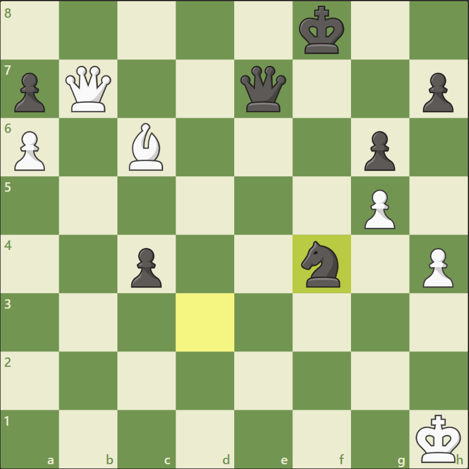{ width=50% }

Imagine que você esteja jogando de brancas a posição do Diagrama 1. Qual é o ataque tático que você tem à sua disposição?

Como vimos, a letra "D", no DAMP, significa um problema de **DEFESA** na posição do seu oponente. Peças sem defesa ou mal defendidas, mesmo que ainda não atacadas, constituem uma das debilidades táticas mais frequentes em uma partida de xadrez.

Examinando a situação de DEFESA das peças pretas, fica evidente que o Cavalo da casa f4 está indefeso.

- Como podemos tirar proveito dessa situação? Por meio de um **ataque duplo**.
- Por que por meio de um ataque-duplo? Porque dessa forma criamos dois problemas que o nosso oponente terá de resolver em um único lance, e nem sempre isso será possível.

Se simplesmente atacarmos uma peça indefesa, o adversário pode movê-la ou defendê-la. Mas, se em vez disso, atacarmos essa peça indefesa e, com esse mesmo lance, atacarmos um outro alvo que também precise ser protegido ou defendido, nosso oponente não terá *tempo suficiente* para resolver esses dois problemas em um único lance.

Por exemplo, se atacarmos a peça indefesa e, ao mesmo tempo, dermos xeque, nosso adversário certamente terá problemas. Como ele fica obrigado, pelas regras do jogo, a resolver o xeque, dificilmente terá como resolver o segundo problema, que é cuidar da peça que está atacada e indefesa.

Munido desse conhecimento, não é difícil encontrar o lance vencedor. Nessa posição, o GM russo Evgeny Gleizerov – rating FIDE 2562 – jogou **55. Db8+**, atacando o Rei e, simultaneamente, o Cavalo de f4, que apresentava um problema de DEFESA. As pretas perderam o Cavalo e abandonaram a partida poucos lances depois.

---

#### Problemas de DEFESA do Rei

Antes de prosseguirmos para a próxima letra do DAMP, é importante chamar a atenção para a especificidade que o Rei apresenta no que diz respeito aos problemas de DEFESA.

No exemplo que acabamos de ver, se o Cavalo de f4 estivesse defendido por uma peça qualquer – por exemplo, por um outro Cavalo posicionado em h5 –, aquele ataque simplesmente não teria funcionado. Após o xeque Db8+, o Cavalo de f4 teria sido atacado, mas estaria defendido pelo Cavalo de h5. Em outras palavras, ele estaria seguro.

E aqui reside a grande diferença que o Rei apresenta, em relação às demais peças, no que diz respeito à DEFESA.

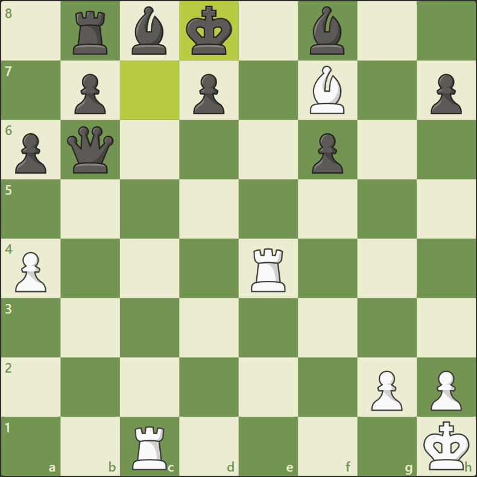{ width=50% }

Na posição do Diagrama 2, o Rei das pretas está "defendido" pela Dama de b6. No entanto, isso não impede as brancas de darem xeque-mate através de **Te8++**.

Em outras palavras, o conceito de DEFESA que se aplica às peças e Peões simplesmente não pode ser estendido ao Rei, pois, se ele for atacado, de nada adianta estar "defendido" por uma outra peça qualquer.

Quando, portanto, podemos dizer que o Rei começa a apresentar problemas de DEFESA, ou seja, quando o xeque-mate começa a deixar de ser algo impossível ou muito improvável para se tornar algo possível ou até mesmo altamente provável?

De forma geral, podemos dizer que *os problemas de DEFESA do Rei começam a surgir* **à medida que as casas próximas à sua posição começam a ser atacadas por três peças ou mais do adversário. Mas mesmo um ataque de apenas duas peças a essas casas já pode significar um problema de DEFESA para o Rei, se uma dessas peças for a Dama.**

**Andrijevic, Milan (2365) vs. Boskovic, Drasko (2341) — Sérvia, 2001**

`1.e4 c5 2.Cf3 e6 3.d4 cxd4 4.Cxd4 Cc6 5.Cc3 Dc7 6.Be2 a6 7.0-0 Cf6 8.Rh1 Be7 9.f4 d6 10.Be3 0-0 11.De1 Cxd4 12.Bxd4 b5 13.a3 Bb7 14.Dg3 Bc6 15.Tae1 Db7 16.Bf3 g6 17.e5 Cd7 18.exd6 Bxd6 19.Ce4 Be7 20.c3 Tad8 21.Dh3 Bxe4 22.Bxe4 Dc7 23.f5 exf5 24.Txf5 Bc5`

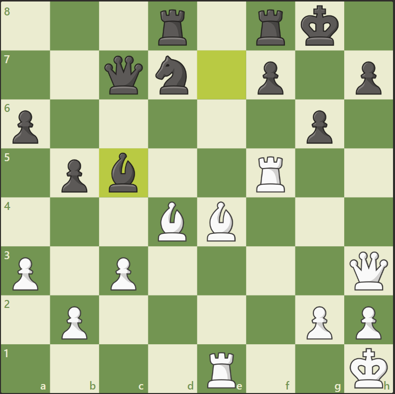{ width=50% }

No Diagrama 3, podemos ver que a posição do Rei das Pretas está atacada por cinco peças: (1) Bispo de d4; (2) Bispo de e4; (3) Torre de f5; (4) Torre de e1 e (5) Dama de h3.

Isso indica que as chances de um ataque bem-sucedido ao Rei são razoavelmente altas e, portanto, devemos começar a calcular a viabilidade concreta desse ataque.

Dada a pressão que essas cinco peças exercem sobre a posição do Rei, não foi difícil para as Brancas encontrarem a sequência correta: **25. Dxh7+** (sacrificando para abrir a posição do Rei) **...Rxh7 26. Th5+** (observe que o Peão de g6 não pode capturar a Torre devido ao ALINHAMENTO do Rei com o Bispo de e4), **26. ... Rg8** (única opção) e, finalmente, **27. Th8++**.

**Husari, Satea (2369) vs. Al-Sayed, Mohammed (2374) — Hungria, 2001**

`1.c4 Cf6 2.Cc3 g6 3.e4 d6 4.g3 c5 5.Bg2 Cc6 6.Cge2 Bg7 7.d3 0-0 8.0-0 Ce8 9.Be3 Cd4 10.Tb1 a5 11.h3 Cc7 12.f4 Tb8 13.a4 Ca6 14.g4 Cb4 15.b3 e6 16.Bf2 f5 17.gxf5 gxf5 18.Cxd4 cxd4 19.Ce2 e5 20.Rh2 fxe4 21.Bxe4 Dd7 22.f5 Txf5 23.Bxf5 Dxf5 24.Cg1 Dg6 25.Cf3 Cxd3 26.Ch4 De4 27.Bg3 Be6 28.Dh5 Cc5 29.Tb2 Cxb3 30.Tg2 Rh8 31.Dg5 Tg8 32.Te1 Dd3 33.De7 Dxc4`

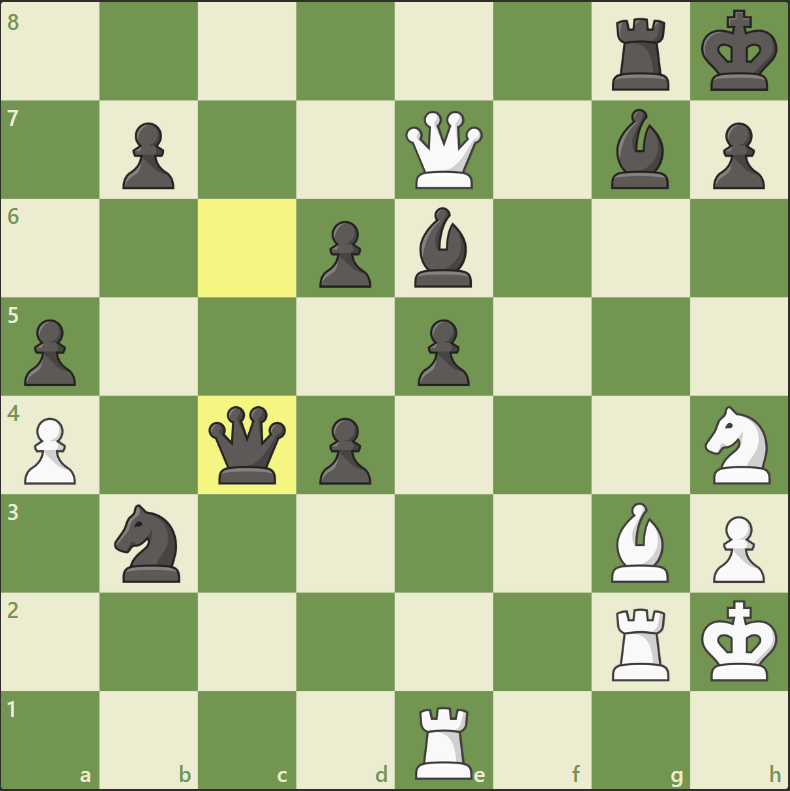{ width=50% }

No Diagrama 4, apesar das casas em torno do Rei das Pretas estarem atacadas de forma imediata por apenas duas peças – a Dama e o Cavalo –, isso é o suficiente para que as Brancas consigam forçar o xeque-mate. **34. Cg6+ hxg6 35. Dh4+ Bh6 36. Dxh6++**.

---

### 2. "A" de Alinhamento

**Womacka, Mathias (2445) vs. Conquest, Stuart C. (2488) — Espanha, 2004**

`1.e4 c5 2.Cf3 d6 3.d4 cxd4 4.Cxd4 Cf6 5.Cc3 Cc6 6.Be2 g6 7.Cb3 Bg7 8.0-0 0-0 9.Bg5 a6 10.Te1 b5 11.Bf1 h6 12.Bh4 Cd7 13.Tb1 Bb7 14.Cd5 Te8 15.Dd2 Cb6 16.f3 Tc8 17.Cxb6 Dxb6+ 18.Bf2 Dc7 19.c4 bxc4 20.Bxc4 Ce5 21.Bf1 Cc6 22.Tec1 Db8 23.Tc2 Cb4 24.Txc8 Bxc8 25.a3 Cc6 26.Ca5 Cxa5 27.Dxa5 Db3 28.Bxa6 Dc2 29.Tf1 Bxa6 30.Dxa6 Dxb2 31.a4 Tb8 32.Da7 Tb7 33.Da8+ Tb8 34.Da7 Tb7 35.Da8+ Rh7 36.a5 Bd4 37.g3 Bxf2+ 38.Txf2 Da1+ 39.Rg2 Tb1 40.a6 Tg1+ 41.Rh3 Rg7 42.Db7 De5 43.Db2 Ta1 44.Dxe5+ dxe5 45.g4 Txa6 46.Rg2 e6 47.Tb2 f5 48.gxf5 exf5 49.Tb7+ Rf6 50.exf5 gxf5 51.Th7 Rg6 52.Te7 Rf6 53.Th7 Ta3 54.Txh6+ Rg5 55.Th3 e4`

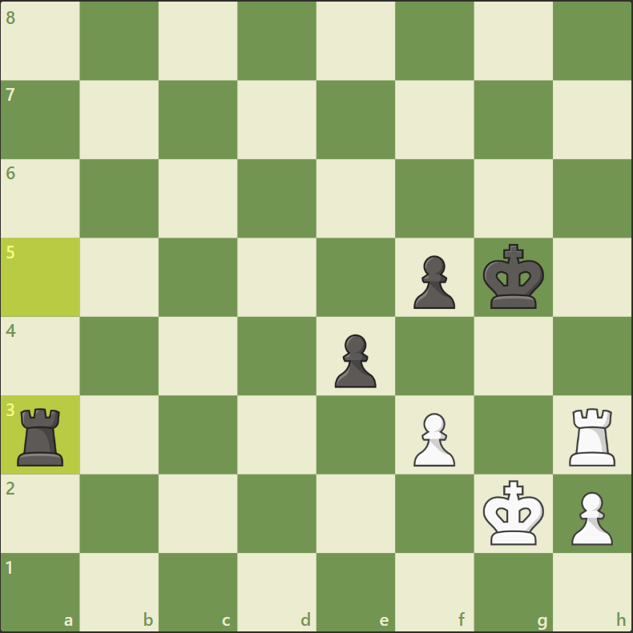{ width=50% }

O que você jogaria de Brancas na posição acima?

O "A", que é a segunda letra do DAMP, indica um problema de **ALINHAMENTO** na posição do nosso oponente. ALINHAMENTOS constituem o segundo tipo de defeito tático.

No Diagrama 5, podemos ver que a Torre Preta de a3 está alinhada com a Torre Branca de h3. Embora a Torre Preta não esteja atacada de forma direta, pois esse ataque está bloqueado pelo Peão das Brancas de f3, existe ali um ataque potencial. Além disso, a Torre das Pretas também está indefesa, ou seja, ela apresenta problemas de ALINHAMENTO e DEFESA.

Como podemos tirar proveito dessa situação? De novo, por meio de um ataque duplo. Se conseguirmos mover a peça que está bloqueando o ataque à Torre Preta de a3 – nesse exemplo o Peão de f3 – de forma a "desbloquear" esse ataque e, ao mesmo tempo, atacar um outro alvo com esse Peão, as Pretas terão de resolver dois problemas em um único lance, o que é, na maior parte das vezes, impossível.

Assim, fica fácil perceber que jogando **55. f4+**, as Brancas decidem a partida. Dão xeque com o Peão e ao mesmo tempo desbloqueiam o ataque da Torre Branca de h3 à Torre Preta de a3. Como as Pretas precisam resolver o xeque, não terão tempo suficiente para resolver o problema da Torre de a3, que agora também está atacada e não defendida.

Infelizmente o GM alemão Mathias Womacka, rating FIDE 2445, não percebeu os problemas de ALINHAMENTO e DEFESA da Torre de seu oponente e, em vez do lance vencedor, jogou **55. Rf2??**, acabando por perder uma partida que estava ganha com o lance 55. f4+.

---

### 3. "M" de Mobilidade

**Birkic, Ante (2351) vs. Ruck, Robert (2571) — Eslovênia, 2002**

`1.e4 c5 2.Cf3 d6 3.d4 cxd4 4.Cxd4 Cf6 5.Cc3 a6 6.Bg5 e6 7.f4 Db6 8.Dd2 Dxb2 9.Cb3 Da3 10.Bxf6 gxf6 11.Be2 Cc6 12.0-0 Bd7 13.De3 Ca5 14.Cb1 Db2 15.Cxa5 Dxa1 16.Ca3 Dxa2 17.Bc4 Db2`

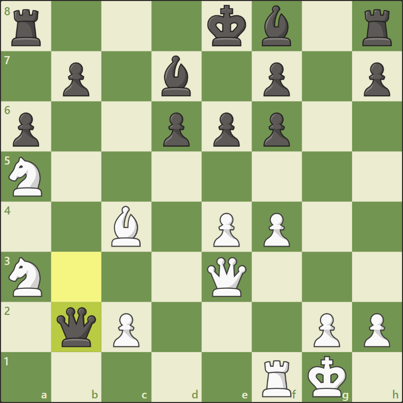{ width=50% }

O que você jogaria de Brancas na posição acima?

Analisando a **MOBILIDADE** das peças Pretas, chama a atenção a situação da Dama de b2. Essa peça está extremamente restringida no que se refere às suas opções de movimento. Ao longo da coluna b, a única casa não atacada pelas Brancas é b4. Ao longo da diagonal a1-e5, da diagonal c1-a3 ou da 2ª linha, todas as casas estão controladas pelas Brancas. A única coisa que falta para que as Pretas percam essa peça é ela ser atacada.

O GM croata Ante Birkic percebe o problema de MOBILIDADE da Dama e liquida a partida com **Tb1**. Simples assim.

É interessante notar que o xeque-mate nada mais é que um problema de MOBILIDADE envolvendo uma peça específica, nesse caso o Rei!

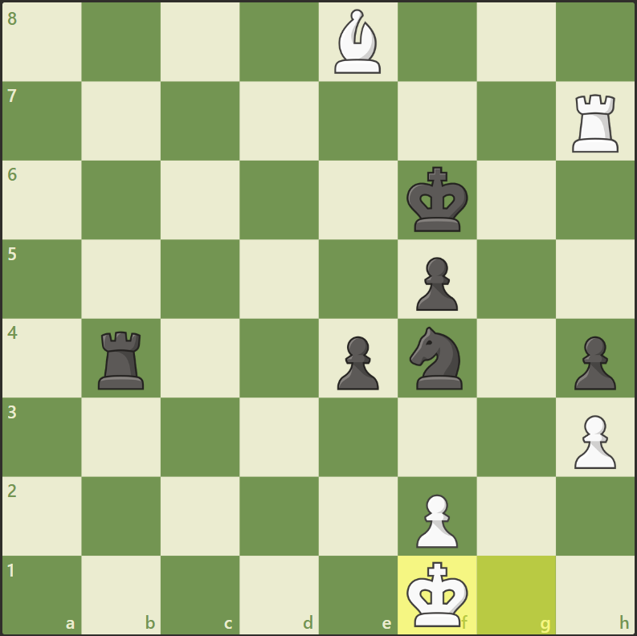{ width=50% }

No Diagrama 7, podemos notar que a MOBILIDADE do Rei Branco já está extremamente limitada, restando-lhe apenas as casas e1 e g1 como possíveis opções de fuga, caso seja atacado.

Nessa posição, as pretas deram mate jogando **Tb1++**, retirando do Rei as duas últimas opções de movimento que ainda lhe restavam.

---

### 4. "P" de Promoção

**Tringov, Georgi (2490) vs. Velimirovic, Dragoljub (2490) — Iugoslávia, 1965**

`1.e4 c5 2.Cf3 Cc6 3.d3 g6 4.g3 Bg7 5.Bg2 d6 6.0-0 e5 7.c3 Cge7 8.a3 0-0 9.b4 a5 10.bxc5 dxc5 11.a4 b6 12.Dc2 Ba6 13.Td1 Dd7 14.Ca3 Tad8 15.Bf1 Cc8 16.Tb1 h6 17.Cb5 Rh7 18.Cd2 C6a7 19.Cxa7 Dxa7 20.Cf3 Dc7 21.Ch4 Td6 22.Cg2 Tfd8 23.Ce3 Dd7 24.Cd5 Ce7 25.c4 Cxd5 26.cxd5 Bc8 27.Bd2 Dc7 28.Tb3 Bd7 29.Da2 h5 30.Tdb1 h4 31.Db2 hxg3 32.hxg3 Bxa4 33.Txb6 Txb6 34.Dxb6 Dxb6 35.Txb6 Ta8 36.Be3 Bf8 37.d6 Bd7 38.Bxc5 Be6 39.Rh2 Tc8 40.Ba3 Tc3`

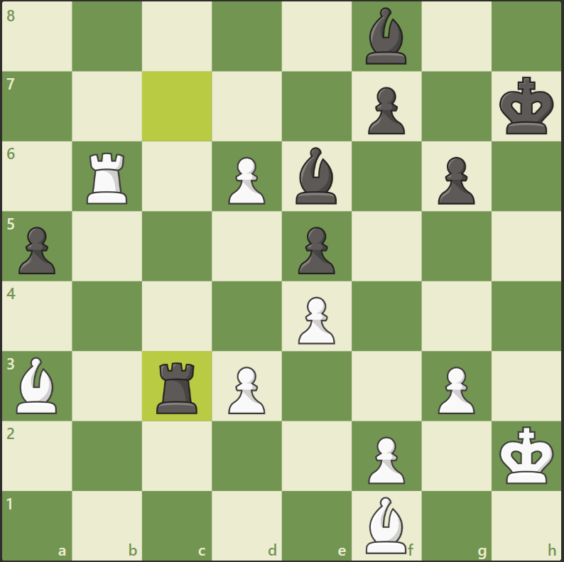{ width=50% }

O que as Brancas deveriam jogar nessa posição?

Como já mencionamos, a **PROMOÇÃO** ou mesmo a ameaça de PROMOÇÃO de um Peão constitui uma das jogadas mais fortes do xadrez, pois ela significa transformar um Peão em uma Dama, com um impacto definitivo sobre a partida.

No diagrama acima, ao examinar as debilidades táticas que existem na posição das Pretas, as Brancas detectam três elementos importantes:

1. Percebem que possuem uma ameaça de PROMOÇÃO de Peão. O Peão Branco em d6 está prestes a ser promovido, e seu avanço constitui um sério problema para as Pretas, que precisam deter essa ameaça a qualquer custo.
2. Detectam também um ALINHAMENTO entre o seu Bispo de a3 e o Bispo Preto de f8, o qual apresenta também um problema de DEFESA (não está defendido).
3. As Brancas notam também que o ataque ao Bispo Preto está sendo bloqueado por seu próprio peão de d6, o mesmo que está ameaçando PROMOÇÃO.

Com o DAMP fazemos a mesma coisa que um quebra-cabeça de pontos numerados. Conectamos as debilidades táticas do oponente para identificar qual é o ataque que temos à nossa disposição.

Assim, mesmo sem nenhum tipo de cálculo, fica fácil identificar a sequência vencedora para as Brancas.

**41. d7!** ameaçando promover no próximo lance e, ao mesmo tempo, "desbloqueando" o ataque ao Bispo Preto de f8. O ataque duplo é constituído por um ataque direto ao Bispo de f8 e por uma ameaça de PROMOÇÃO.

Agora, se as Pretas capturam o Bispo Branco de a3 com sua Torre de c3, as Brancas simplesmente jogam **42. d8=D**, e ganham. As Pretas, portanto, são obrigadas a capturar o Peão que ameaça promover, jogando **41. ... Bxd7**. Isso deixa um tempo para que as Brancas possam jogar **42. Bxf8**, capturando a peça que apresentava problemas de ALINHAMENTO e de DEFESA.

Como você já deve estar percebendo, os problemas de DEFESA, ALINHAMENTO, MOBILIDADE e ameaça de PROMOÇÃO formam a estrutura básica de todas as operações táticas no xadrez.

À medida em que você consolidar o hábito de examinar essas debilidades na posição do seu oponente, sua capacidade de visualizar táticas vai avançar mais rapidamente do que você imagina.

---

### 5. Mapeando os DAMPs

Dado o papel crucial que os DAMPs desempenham no jogo tático, é importante que você disponha de um método estruturado para identificá-los com rapidez e segurança, ao longo de uma partida.

A maneira mais fácil de identificar os DAMPs em uma dada posição consiste em examinar as peças do oponente, **uma de cada vez, em ordem decrescente de importância**. Você deve começar pelo Rei, passando em seguida para a Dama, Torres, Bispos, Cavalos e, finalmente, os Peões.

Ao examinar cada uma das peças do oponente, você deve procurar identificar se ela apresenta algum DAMP, ou seja, algum problema de **DEFESA, de ALINHAMENTO ou de MOBILIDADE**, nesta mesma ordem.

E quanto às ameaças de PROMOÇÃO? Para isso, obviamente, você terá de examinar a situação dos seus próprios Peões, para ver se algum deles ameaça se transformar em uma peça de maior valor nos próximos lances.

---

**Volkov, Sergey (2594) vs. Solodovnichenko, Yuri (2564) — Rússia, 2009**

`1.d4 d5 2.c4 dxc4 3.e4 e5 4.Cf3 exd4 5.Bxc4 Cc6 6.0-0 Be6 7.Bb5 Bc5 8.b4 Bb6 9.a4 a6 10.Bxc6+ bxc6 11.a5 Ba7 12.Bb2 Cf6 13.Cbd2 0-0 14.Dc2 Ch5 15.g3 f5 16.Dxc6 Bf7 17.Ce5 Be8 18.Dxa6 Rh8 19.Db7 fxe4 20.Cxe4 Cf6 21.Cxf6 Txf6 22.Tac1 Te6 23.Tfe1 c6 24.Cd3 Bd7 25.Txe6 Bxe6 26.Te1 Bd5 27.Cf4 Bf3 28.Ce6 Dg8 29.Cc7 d3 30.Cxa8 d2`

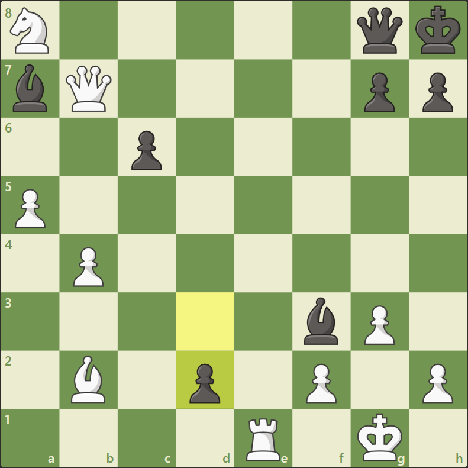{ width=50% }

Vamos imaginar que estamos jogando de Brancas. Começamos examinando a situação de cada uma das peças Pretas (Peões inclusive), para verificar se apresentam algum problema de DEFESA, ALINHAMENTO ou MOBILIDADE. Fazemos isso em ordem decrescente de valor.

**Rei:**

- **DEFESA:** As casas próximas ao Rei estão atacadas pela Dama de b7, pelo Bispo de b2, e também pela Torre de e1, que pode ser rapidamente mobilizada para atacar a 7ª ou a 8ª fila. Temos assim três peças atacando as casas próximas ao Rei – sendo uma delas a Dama –, o que indica que o Rei apresenta um problema de DEFESA.
- **ALINHAMENTO:** O Rei apresenta também um problema de ALINHAMENTO com o Bispo de b2. O ataque desse Bispo ao Rei está bloqueado pelo Peão das Pretas de g7. Portanto, enquanto esse alinhamento persistir, a peça que estiver em g7 não poderá se mover.
- **MOBILIDADE:** O Rei claramente apresenta um problema de MOBILIDADE.

Essas três debilidades táticas sugerem que as chances de um mate são elevadas. Se as Brancas atacarem o Rei por meio de **31. Dxg7+**, ao responder com **31. ...Dxg7** (única opção), a Dama das Pretas fica totalmente atada nessa posição (g7) em função do ALINHAMENTO do Rei com o Bispo de b2. Além disso, a 8ª linha ficou totalmente desprotegida, possibilitando **32. Te8++**.

---

**Browne, Walter S. (2560) vs. Orlov, Georgi (2470) — Estados Unidos, 1995**

`1.d4 Cf6 2.c4 Cc6 3.Cf3 e6 4.Cc3 Bb4 5.Dc2 d6 6.a3 Bxc3+ 7.Dxc3 0-0 8.b4 e5 9.dxe5 Cxe5 10.Cxe5 dxe5 11.Dxe5 Te8 12.Db2 Cg4 13.Dc3 a5 14.Bb2 Dg5 15.h4 Dh6 16.Td1 axb4 17.axb4 Ta6 18.Th3 Tf6 19.Bc1 Dh5 20.f3 Ce5 21.g4 Cxg4 22.fxg4 Bxg4 23.Te3 Dxh4+ 24.Rd2 Ta8 25.Rc2 Bf5+ 26.Rb3 Be6 27.Bh3 Bxh3 28.Txh3 Dg4 29.Tdd3 h6 30.Thf3 Txf3 31.Txf3 Dg2`

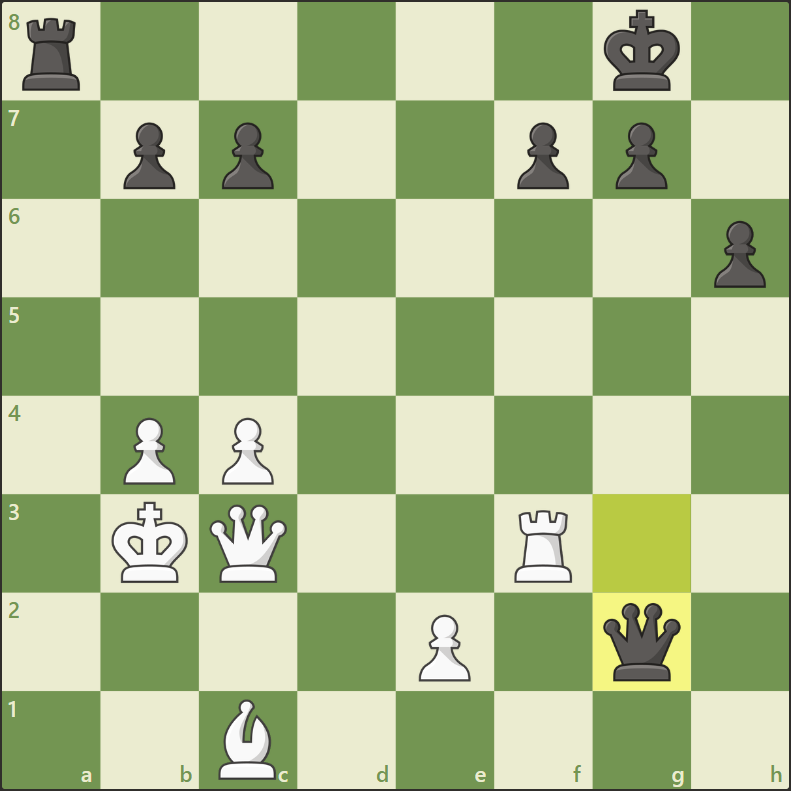{ width=50% }

**Rei:**

- **DEFESA:** As casas próximas ao Rei das Pretas estão atacadas pela Dama de c3, pela Torre de f3 e pelo Bispo de c1. Quando as casas próximas ao Rei estão atacadas por pelo menos três peças quaisquer, ou mesmo por duas peças se uma delas for a Dama, podemos considerar que o Rei apresenta um problema de DEFESA. De fato, se a Torre das Brancas estivesse posicionada em g3, a partida estaria decidida com **32. Dxg7++**.
- **ALINHAMENTO:** O Rei apresenta um ALINHAMENTO com sua própria Dama de g2 e outro com sua Torre de a8.
- **MOBILIDADE:** O Rei dispõe de alguma mobilidade (f8, h8 e h7), mas se for atacado pela Dama essa mobilidade subitamente desaparece, dado o elevado poder ofensivo dessa peça.

**Dama:**

- **DEFESA:** A Dama das pretas não está defendida. Se as Brancas conseguirem atacar a Dama indefesa e, com o mesmo lance, criar alguma ameaça mais séria – por exemplo, uma ameaça de mate – a Dama das Pretas estará em apuros.

A simples observação dessas debilidades foram suficientes para que as Brancas encontrassem a sequência vencedora: **32. Tg3** (ataque duplo: ataque à Dama indefesa e, ao mesmo tempo, ameaça de mate no próximo lance) **32...Dxg3** (forçado, para evitar o mate) e **33. Dxg3**.

---

**Francsics, Endre (2271) vs. Szudra, Heinz-Werner (2046) — Hungria, 2001**

`1.d3 d5 2.g3 Cf6 3.Bg2 g6 4.Cf3 Bg7 5.Cbd2 c5 6.e4 Cc6 7.0-0 0-0 8.c3 d4 9.cxd4 cxd4 10.a3 Bg4 11.h3 Bxf3 12.Dxf3 Cd7 13.b4 Cb6 14.Dd1 Dd7 15.f4 Tac8 16.Db3 Cd8 17.Bb2 Ca4 18.e5 Cxb2 19.Dxb2 Ce6 20.Tac1 Txc1 21.Txc1 Tc8 22.Tc2 Bh6 23.Ce4 Tc7 24.Dc1 Txc2 25.Dxc2 Db5 26.Dc8+ Rg7 27.Cf2 b6`

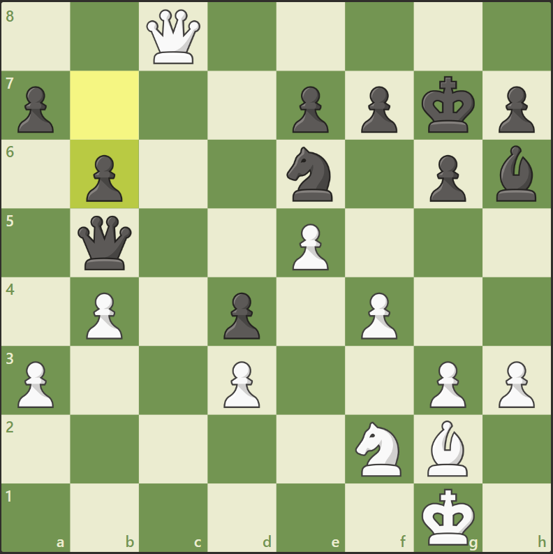{ width=50% }

**Rei:**

- **DEFESA:** As casas f8, g8 e h8 estão atacadas pela Dama e, portanto, apresentam-se bastante vulneráveis, embora as Brancas não disponham de uma peça que possa apoiar a Dama em um eventual ataque ao Rei por meio de **28. Dg8** ou **28. Dh8**.
- **ALINHAMENTO:** O Rei das Pretas não parece apresentar nenhum tipo de ALINHAMENTO relevante.
- **MOBILIDADE:** O Rei apresenta um problema crítico de MOBILIDADE, pois nessa posição ele não dispõe de nenhuma casa segura para onde possa se mover. Entretanto, as Brancas também não possuem meios para atacar o Rei de forma imediata.

**Dama:**

- **DEFESA:** A Dama apresenta um problema de DEFESA muito claro, pois não está defendida por nenhuma peça ou peão.
- **ALINHAMENTO:** Não apresenta nenhum ALINHAMENTO relevante.
- **MOBILIDADE:** A Dama parece apresentar um problema sério de MOBILIDADE, pois dispõe apenas da casa a4, caso precise se mover. Portanto, se ela for atacada por uma peça que ataque também a4 (sua única casa de fuga), ela poderá ser capturada.

**28. Bc6!** consegue as duas coisas, ou seja, ataca não apenas a Dama, mas também sua única casa de fuga a4. Após esse lance, as Pretas abandonaram a partida.